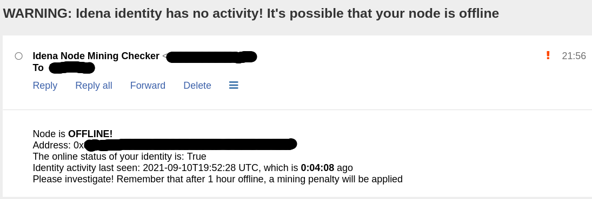

# Idena node mining monitor

Script to check if an idena identity is mining. Uses idena API to check last activity of the address.

In the [idena](https://idena.io) Proof-of-Person blockchain, individual identities that are validated are encouraged to run their own [node](https://github.com/idena-network/idena-go) on a VPS or on their home PC if their network and hardware can handle it. This node is tied to their identity and can be set to mining mode which earns them iDNA for issuing and verifying blocks.

The protocol issues a penalty if your node is offline for more than 1 hour while set to mining mode. This script's purpose is to notify you if your node is offline for (by default) 30 minutes or more, so you can react on time to bring it back online. It is recommended to keep 30 minutes as the threshold because there are times when your node can be online and mining, but not "active" in the sense that it will show up in the API this script uses for checking activity. If you reduce the threshold you will most likely get false positives, but even at 30 minutes you should verify manually that your node is actually offline.

WARNING: The e-mail alerts work only with a localhost MTA without authentification or encryption

**Usage**:

1. clone this repo
2. make sure you have the [requests python library](https://docs.python-requests.org/en/master/) installed
3. rename `minewatch.ini_default` to `minewatch.ini`
4. edit minewatch.ini with the address of the identity you wish to monitor and the from/to emails for the alerts
5. set up a cron job to run the script at whatever interval you feel comfortable with. I think 10 minutes is optimal.
6. If you want to test the script, set the ALLOWEDTIME in config file to something really low, and run the script manually

If you encounter any issues please double-check the configuration as no error checks are performed on the configuration parameters
